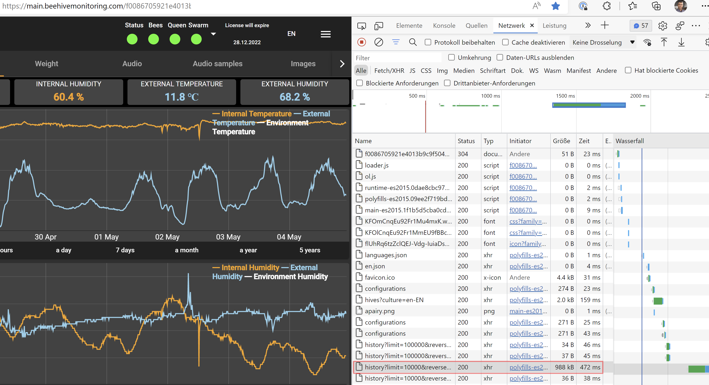
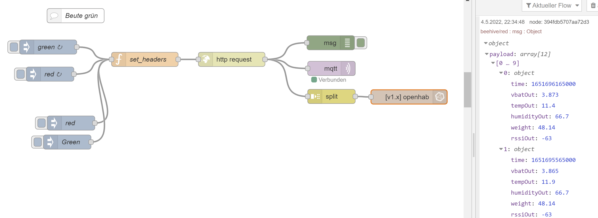
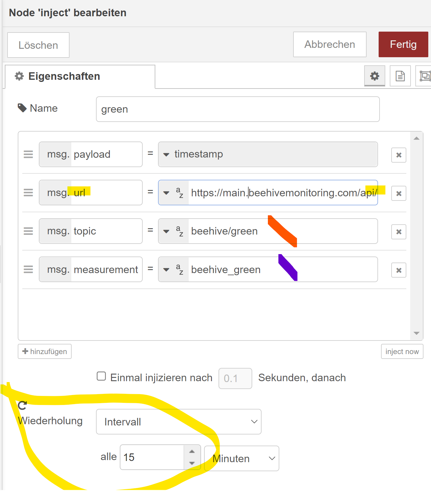

# Devices of beehivemonitoring.com

This is a Documentation-project for the very good products of [beehivemonitoring.com](https://www.beehivemonitoring.com/). 
It will make you able to get the data from the products wether by reading the BLE (data from the products will be emitted by Bluetooth-Low-Energy-Protocoll) with an own BLE device (for example an ESP with [openmqttgateway](https://docs.openmqttgateway.com/) or via API from the data-website of beehivemonitoring.com.
## Getting Data through a BLE device

I played a lot with openmqttgateway until i figured the way over API - which is much more easy and relliable - but as it was a lot work the python contains everything i reverse-engineered so far. And it worked until bad weather and a bad case bricked my ESP device...

If you are up to the task you could write a direct support to openmqttgateway with this code. 
I was done...

The **bluezQt**-Folder takes a plain-data send of a openmqttgateway and transforms the data to a "readable" format.
The **beehivemonitoring_devices.py** is the simple test-code to adapt the reengineering.

## Getting data through the Website

When receiving a scale, or a hiveheart for the first time - you receive a paper with a QR Code to get your Data on your mobile device. This contains also a ---**accesskey**--- looking like the following

_f0086705921e4013b9c9f5fffffffff_

This will lead in combinations to your Computer accessible data-homepage
https://main.beehivemonitoring.com/---accesskey---

While debugging the website with developer-tools i figured that the following url is delivering your data as plain json format.

The **$hivenumber** seems to be numbered straight - ahead and is not attached to the documentation.
So you need to figure this by debugging your browser.

The **$timeback_limit** will take historic data - for a regular basis you just need to grab 6 to 12 lines. More will just repeat the data.

The attributes is the list of data to be received. I didn't change it.

Example Url - check for $hivenumber and $timeback_limit for adaptions:

https://main.beehivemonitoring.com/api/hives/$hivenumber/history?limit=$timeback_limit&reverse=true&attributes=inCounts;outCounts;inCounts;outCounts;inCounts;outCounts;inCounts;outCounts;inCounts;outCounts;inCounts;outCounts;inCounts;outCounts;inCounts;outCounts;inCounts;outCounts;inCounts;outCounts;inCounts;outCounts;inCounts;outCounts;tempIn;tempOut;tempC;tempEnv;humidityIn;humidityOut;humidityC;humidityEnv;weight;;pressure;pressureC;pressureGw;pressureEnv;frequency;amplitude;vbatIn;vbatOut;vbatEnv;vbatGw;rssiIn;rssiOut;rssiEnv;rssiGw;inTotal;outTotal;co2;tvoc;co;o2;o3;so;pm25;pm10;magX;magY;magZ;accX;accY;accZ

## Node-Red automation
I am a fan of Node-Red - as it makes programming very easy. From here it's easy to regularly grab the url and push the data to MQTT or directly in my case to a influxdb.

The main trick is to set everything in the inject-timer

**topic** contains the MQTT topic and **measurement** the InfluxDB "table".

This is the function **set_header**

    msg.headers = {
        "accept": "application/json, text/plain, */*",
        "accept-language": "de,de-DE;q=0.9,en;q=0.8,en-GB;q=0.7,en-US;q=0.6",
        "sec-ch-ua": "\" Not A;Brand\";v=\"99\", \"Chromium\";v=\"100\", \"Microsoft Edge\";v=\"100\"",
        "sec-ch-ua-mobile": "?0",
        "sec-ch-ua-platform": "\"Windows\"",
        "sec-fetch-dest": "empty",
        "sec-fetch-mode": "cors",
        "sec-fetch-site": "same-origin",
        "webapphive": "true",
        "x-auth-token": "your_accesskey"
    };
    msg.referrer = "https://main.beehivemonitoring.com/your_accesskey";
    msg.referrerPolicy = "strict-origin-when-cross-origin";
     
    msg.mode = "cors";
    msg.credentials =  "include";

    return msg;

